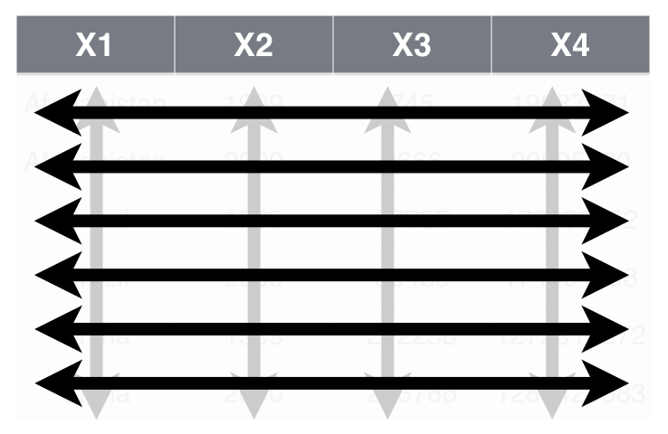

```{r setup, include=FALSE, cache=FALSE}
# Set global R options
options(htmltools.dir.version = FALSE, servr.daemon = TRUE)

# Set global knitr chunk options
knitr::opts_chunk$set(
  fig.align = "center", 
  cache = TRUE,
  error = FALSE,
  message = FALSE, 
  warning = FALSE, 
  collapse = TRUE 
)

# This is good for getting the ggplot background consistent with
# the html background color
library(ggplot2)
thm <- theme_bw()
theme_set(thm)
```

layout:true

# Tidy Data

---

class: inverse, center, middle

----

---

# Tidy Data

<br><br>
```{r tidy-ds-task, echo=FALSE}

```

---


## Tidy data simplifies life

.pull-left[

<br>
.font130[

A data set is tidy if:

1. Each .blue[__variable__] in in its own .blue[__column__]

2. Each .red[__observation__] is in its own .red[__row__]

3. Each .grey[__value__] is in its own .grey[__cell__]

]
]

.pull-right[
<br>

```{r tidy-data-example, echo=FALSE}

```

]

---


.pull-left[

You are going to learn four key __tidyr__ functions that allow you to solve the vast majority of your data tidying challenges:

- `pivot_longer`: transforms data from wide to long

- `pivot_wider`:  transforms data from long to wide

- `separate`:  splits a single column into multiple columns

- `unite`:  combines multiple columns into a single column

]

.pull-right[

<br>

```{r tidyr-hex, echo=FALSE, out.width="50%", out.height="50%"}
knitr::include_graphics("images/tidyr-large.png")
```

]

---

layout: false

# Prerequisites

.pull-left[

### Packages

```{r eval=FALSE}
library(tidyverse) # or directly w/library(tidyr)
```


]

.pull-right[

### Data

Follow along in examples:

```{r}
load("data/tidy_data.RData")
```

Your turn exercises:

```{r}
bomber_wide <- read_rds("data/bomber_wide.rds")
bomber_long <- read_rds("data/bomber_long.rds")
bomber_prefix <- read_rds("data/bomber_prefix.rds")
bomber_mess <- read_rds("data/bomber_mess.rds")
```

]

---

# .red.font120[`pivot_longer`]: wide to long

.bold[We can transform wide data to long with .font140.grey[`pivot_longer()`]]

.center[

```{r gather1-plot, echo=FALSE, out.height="40%", out.width="40%"}

```

]

--

.center[

.blue[cases] %>% pivot_longer(!country, names_to = "Year", values_to = "n")
.white.font80[
.content-box-blue-dark[data frame to transform].content-box-white[name of new key colum] .content-box-white[name of new value column].content-box-white[columns selection]
]

]

---

# .red.font120[`pivot_longer`]: wide to long

.bold[We can transform wide data to long with .font140.grey[`pivot_longer()`]]

.center[

```{r gather2-plot, echo=FALSE, out.height="40%", out.width="40%"}

```

cases %>% pivot_longer(!country, names_to = .green["Year"], value_to = "n")
.white.font80[
.content-box-blue[data frame to transform].content-box-green-dark[name of new key colum] .content-box-white[name of new value column].content-box-white[columns selection]
]

]

---

# .red.font120[`pivot_longer`]: wide to long

.bold[We can transform wide data to long with .font140.grey[`pivot_longer()`]]

.center[

```{r gather3-plot, echo=FALSE, out.height="40%", out.width="40%"}

```

cases %>% pivot_longer(!country, names_to = "Year", value_to = .red["n"])
.white.font80[
.content-box-blue[data frame to transform].content-box-green[name of new key colum] .content-box-red-dark[name of new value column].content-box-white[columns selection]
]

]

---

# .red.font120[`pivot_longer`]: wide to long

.bold[We can transform wide data to long with .font140.grey[`pivot_longer()`]]

.center[

```{r gather4-plot, echo=FALSE, out.height="40%", out.width="40%"}
knitr::include_graphics("images/tidyr-04.png")
```

cases %>% pivot_longer(.grey[!country], names_to = "Year", value_to = "n")
.white.font80[
.content-box-blue[data frame to transform].content-box-green[name of new key colum] .content-box-red[name of new value column].content-box-grey-dark[columns selection]
]

]

---

# .red.font120[`pivot_longer`]: wide to long

.bold[We can transform wide data to long with .font140.grey[`pivot_longer()`]]


.pull-left[

.center.font120.bold[Cod Alternatives]

```{r, eval=FALSE}
# These all produce the same results:
cases %>% pivot_longer(cols = 2:4, 
                       names_to = "Year", 
                       values_to = "n")
cases %>% pivot_longer(cols = `2011`:`2013`, 
                       names_to = "Year", 
                       values_to = "n")
cases %>% pivot_longer(cols = c(`2011`,`2012`,`2013`), 
                       names_to = "Year", 
                       values_to = "n")
cases %>% pivot_longer(cols = starts_with("20"), 
                       names_to = "Year", 
                       values_to = "n")
cases %>% pivot_longer(cols = -country, 
                       names_to = "Year", 
                       values_to = "n")
```

]

.pull-right[

```{r gather5-plot, echo=FALSE}
knitr::include_graphics("images/tidyr-04.png")
```

]

---

# .red.font120[`pivot_wider`]: long to wide

.bold[We can transform long data to wide with .font140.grey[`pivot_wider()`]]

.center[

```{r spread-1-plot, echo=FALSE, out.height="40%", out.width="40%"}

```

]

--

.center[

cases %>% pivot_wider(names_from = .purple[Year], valueS_from = .red[n])
.white.font80[
.content-box-purple-dark[column to use as new column names] .content-box-red-dark[column to use as values]
]

]

---

class: yourturn
# Your Turn!

.pull-left[

### Challenge

1. Reshape the `bomber_wide` data from ___wide to long___ and name the new value column "Flying_Hrs"

2. Reshape the `bomber_long` data from ___long to wide___ using the "Output" variable for the new column names and the "Value" variable to fill in values

]

--

.pull-right[

### Solution

```{r your-turn-gather}
# 1
bomber_wide %>%
  pivot_longer(cols = `1996`:`2014`, 
               names_to = "Year", 
               values_to = "Flying_Hrs") %>%
  head()

```

]

---

class: yourturn
# Your Turn!

.pull-left[

### Challenge

1. Reshape the `bomber_wide` data from ___wide to long___ and name the new value column "Flying_Hrs"

2. Reshape the `bomber_long` data from ___long to wide___ using the "Output" variable for the new column names and the "Value" variable to fill in values

]

.pull-right[

### Solution

```{r your-turn-spread}
# 2
bomber_long %>%
  pivot_wider(names_from = Output,
              values_from = Value) %>%
  head()

```

]

---

# .red.font120[`separate`]: one to multiple

.bold[We can split a single column into multiple columns using .grey[`separate()`]]

.center[

```{r separate-1-plot, echo=FALSE, out.height="90%", out.width="90%"}

```

]

---

# .red.font120[`separate`]: one to multiple

.bold[We can split a single column into multiple columns using .grey[`separate()`]]

.center[

```{r separate-2-plot, echo=FALSE, out.height="90%", out.width="90%"}

```

]


.center[

storms %>% separate(col = .purple[date], into = c("year", "month", "day"), sep = "-")
.white.font80[
.content-box-purple-dark[column to split] .content-box-white[names of new columns] .content-box-white[separator to split by]
]

]

---

# .red.font120[`separate`]: one to multiple

.bold[We can split a single column into multiple columns using .grey[`separate()`]]

.center[

```{r separate-3-plot, echo=FALSE, out.height="90%", out.width="90%"}

```

]


.center[

storms %>% separate(col = date, into = .red[c("year", "month", "day")], sep = "-")
.white.font80[
.content-box-purple[column to split] .content-box-red-dark[names of new columns] .content-box-white[separator to split by]
]

]
---


# .red.font120[`separate`]: one to multiple

.bold[We can split a single column into multiple columns using .grey[`separate()`]]

.center[

```{r separate-4-plot, echo=FALSE, out.height="90%", out.width="90%"}

```

]


.center[

storms %>% separate(col = date, into = c("year", "month", "day"), sep = .grey["-"])
.white.font80[
.content-box-purple[column to split] .content-box-red[names of new columns] .content-box-grey-dark[separator to split by]
]

]

---

# .red.font120[`unite`]: multiple to one

.bold[We can combine multiple columns into one using .grey[unite()`]]

.center[

```{r unite-plot, echo=FALSE, out.height="90%", out.width="90%"}

```

]


.center[

storms %>% unite(col = .purple[date], .red[c("year", "month", "day")], sep = "-")
.white.font80[
.content-box-purple-dark[new column name] .content-box-red-dark[colums to combine] .content-box-grey-dark[separator to use]
]

]

---

class: yourturn
# Your Turn!

.pull-left[

### Challenge

1. Reshape the `bomber_prefix` data so that the "prefix" and "number" columns are combined into a “MD” variable with “-“ separator

]

--

.pull-right[

### Solution

```{r your-turn-unite}
bomber_prefix %>%
  unite(col = MD, prefix, number, sep = "-") %>% 
  head

```

]


---

# Leverage cheat sheet

.font130.center[Use __tidyr__ tips on back of Data Import cheat sheet]

.font120.center[[hrstudio.com/resources/cheatsheets](https://www.rstudio.com/resources/cheatsheets/)]

```{r tidyr-cheat-sheet, echo=FALSE}

```

---

class: yourturn

# Big Challenge

.pull-left[

### Challenge

.font120[Reshape the __bomber_mess__ data so it looks like:]

```{r big-challenge, echo=FALSE}
bomber_mess %>%
  unite(col = MD, prefix:number, sep = "-") %>%
  separate(Metric, into = c("FY", "Output")) %>%
  pivot_wider(names_from= Output, 
              values_from = Value) %>%
  as_tibble()
```

]

--

.pull-right[

### Solution

```{r big-challenge-solution}
bomber_mess %>%
  unite(col = MD, prefix:number, sep = "-") %>%
  separate(Metric, into = c("FY", "Output")) %>%
  pivot_wider(names_from= Output, 
              values_from = Value) %>%
  as_tibble() %>% head
```

]

---

# Key things to remember

.pull-left[

<br>

* .bold[`pivot_longer`]: reshape wide data to long

* .bold[`pivot_wider`]: reshape long data to wide

* .bold[`separate`]: reshape a single variable into multiple

* .bold[`unite`]: reshape multiple variables into one

* .bold[Note:] .bold[`tidyr`] just got some updates and some of this functionality will 
  be changing (i.e. `gather()` and `spread()` are changing to `pivot_longer()` and 
  `pivot_wider()`)

]

.pull-right[

<br><br>
```{r, echo=FALSE}

```


]

---

# Questions?

<br>

```{r questions-tidyr, echo=FALSE, out.height="450", out.width="450"}
knitr::include_graphics("images/questions.png")
```

